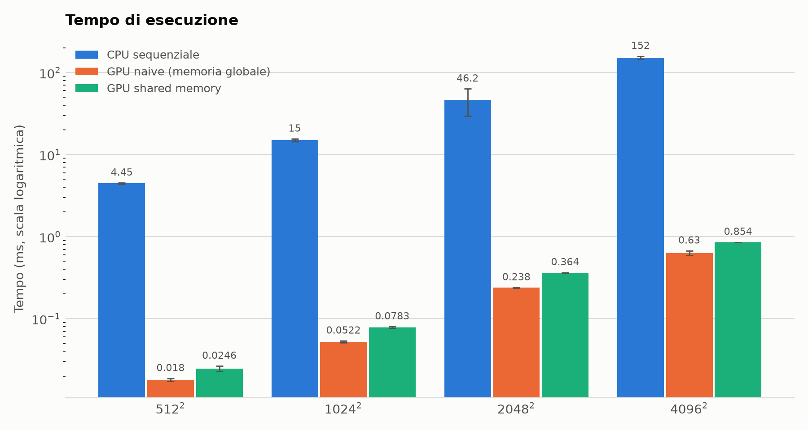
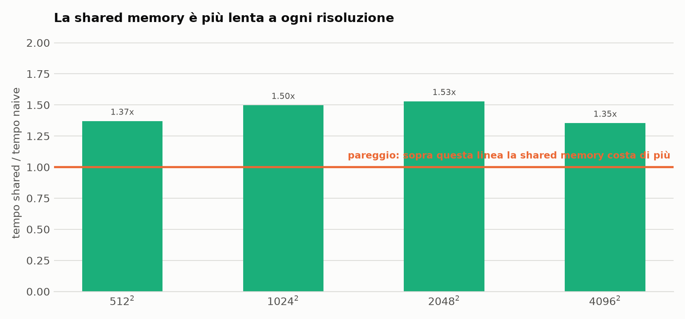
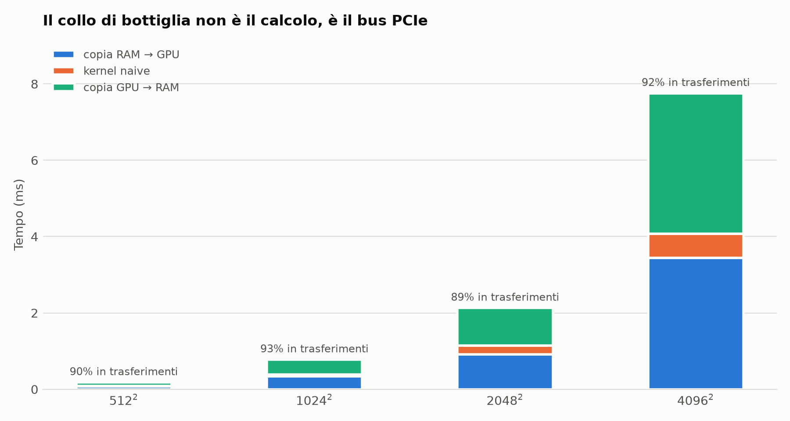
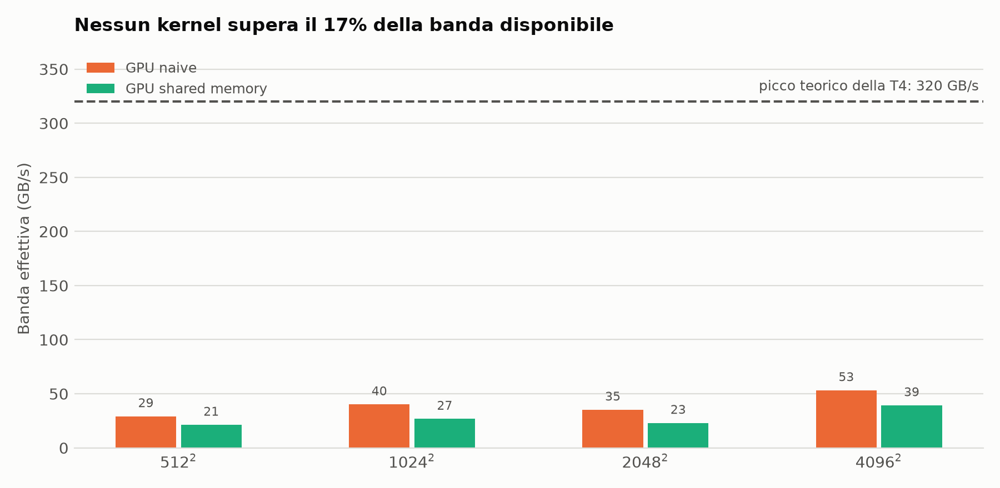

# Accelerazione su GPU di un filtro box blur 3×3

### Quando la shared memory non conviene: un caso misurato

**Advanced Computer Architecture** — traccia *Image and video processing: filters on images*

_Autore: [nome e matricola]_ · _Codice e dati: [github.com/santoromarco74/adv_comp_proj](https://github.com/santoromarco74/adv_comp_proj)_

---

## 1. Problema affrontato

Il **box blur** sostituisce ogni pixel di un'immagine con la media dei suoi nove vicini (sé stesso e gli otto adiacenti). È uno *stencil* bidimensionale: l'operazione su ciascun pixel è indipendente da quella su tutti gli altri, il che lo rende un candidato naturale per l'esecuzione su GPU, dove milioni di thread possono lavorare simultaneamente su dati diversi eseguendo la stessa istruzione (modello SIMT).

Il progetto ha due obiettivi:

1. **Quantificare** il guadagno ottenibile spostando il filtro dalla CPU alla GPU, distinguendo il tempo di calcolo dal tempo di trasferimento dei dati.
2. **Verificare** se l'ottimizzazione classica per questo tipo di problema — il *tiling* in shared memory — porti effettivamente un beneficio.

Il secondo punto è quello che ha prodotto il risultato più interessante, e in un certo senso inatteso: **su questo problema la shared memory non conviene**, ed è più lenta della versione ingenua di un fattore compreso fra 1,35 e 1,53. La sezione 7 spiega perché, e perché il risultato è coerente con la teoria anziché contraddirla.

---

## 2. Ambiente sperimentale

| | |
|---|---|
| GPU | NVIDIA Tesla T4 — compute capability 7.5 (Turing) |
| Multiprocessori | 40 SM |
| Shared memory | 48 KB per blocco, 64 KB per multiprocessore |
| Banda di memoria di picco | 320,1 GB/s |
| Toolkit / driver | CUDA 13.0, driver 580.82.07 |
| Piattaforma | Google Colab, runtime GPU |
| Compilazione | `nvcc -O3 -arch=sm_75` |

Il flag `-arch=sm_75` non è un dettaglio: senza di esso il binario non contiene codice macchina per Turing, e la GPU deve compilare il PTX al volo al primo lancio. Il costo di quella compilazione ricade sulla prima misura e la falsa completamente (§ 5).

La banda di picco è calcolata dal programma stesso a partire dalle proprietà del device, come `2 × memoryClockRate × memoryBusWidth / 8`.

---

## 3. Strategie implementative

Sono state realizzate tre versioni dello stesso identico calcolo, in modo che i risultati siano confrontabili bit per bit.

### 3.1 Riferimento CPU sequenziale

Due cicli annidati sui pixel, con due cicli interni sulla finestra 3×3. Un solo core, nessuna vettorizzazione esplicita. Serve come termine di paragone e, soprattutto, come **oracolo di correttezza** per le versioni GPU.

### 3.2 Kernel GPU "naive" — memoria globale

Un thread per pixel. Ogni thread ricava le proprie coordinate dalla posizione del blocco e dalla propria posizione al suo interno:

```cuda
int x = blockIdx.x * blockDim.x + threadIdx.x;
int y = blockIdx.y * blockDim.y + threadIdx.y;
if (x >= width || y >= height) return;
```

I blocchi sono di 16×16 = 256 thread. Su un'immagine 2048×2048 questo significa 128×128 = 16 384 blocchi, per un totale di 4,2 milioni di thread. Il controllo di bordo serve perché quando la larghezza non è multipla di 16 l'ultimo blocco sborda: senza il controllo si scriverebbe fuori dall'area allocata.

Ogni thread legge i nove vicini **direttamente dalla memoria globale**. Poiché i pixel vicini condividono gran parte della finestra, ciascun pixel viene riletto fino a nove volte complessivamente.

### 3.3 Kernel GPU "shared" — tiling con halo

È la versione che dovrebbe eliminare le riletture. Ogni blocco copia preventivamente in shared memory la porzione di immagine che gli serve, e poi calcola leggendo solo da lì.

La porzione non è 16×16 ma **18×18**: per calcolare i pixel sul bordo del tile servono anche i pixel immediatamente esterni. Quella cornice di un pixel si chiama *halo*.

```
┌─────────────────────┐
│ ░░░░░░░░░░░░░░░░░░░ │  ░ = halo (68 celle)
│ ░ ███████████████ ░ │  █ = tile calcolato (16×16 = 256 pixel)
│ ░ █             █ ░ │
│ ░ ███████████████ ░ │  totale caricato: 18×18 = 324 celle
│ ░░░░░░░░░░░░░░░░░░░ │
└─────────────────────┘
```

Il caricamento avviene in tre fasi: ogni thread carica il proprio pixel centrale; i thread sul perimetro del blocco caricano anche la cella di halo adiacente; i quattro thread d'angolo caricano gli angoli. Segue una barriera `__syncthreads()`, necessaria perché un thread interno legge celle scritte da *altri* thread. La barriera è locale al blocco — thread di blocchi diversi non possono sincronizzarsi, e non ne hanno bisogno, perché ogni blocco possiede la propria copia privata di shared memory.

Questa organizzazione ha un costo, che risulterà decisivo (§ 7): dei 256 thread del blocco, **solo 60 partecipano al caricamento dell'halo**, distribuiti su otto rami condizionali distinti, mentre i restanti 196 attendono alla barriera.

### 3.4 Gestione dei bordi dell'immagine

Sui bordi la finestra 3×3 si restringe, e la media viene calcolata dividendo per il numero di vicini effettivamente esistenti anziché per nove:

```cuda
out[y * width + x] = (unsigned char)(sum / count);
```

La divisione è **intera**. È una scelta deliberata: rende il risultato esatto e riproducibile, e permette di confrontare CPU e GPU con un'uguaglianza stretta invece che con una tolleranza numerica. Le tre implementazioni applicano la stessa regola, quindi devono produrre immagini identiche byte per byte.

---

## 4. Struttura del codice

| File | Contenuto |
|---|---|
| `benchmark.cu` | i due kernel, il riferimento CPU, l'infrastruttura di misura e verifica |
| `test_host.cu` | verifica di correttezza eseguibile anche in assenza di GPU |
| `real_image_blur.cu` | applicazione del filtro a una fotografia reale |
| `adv_comp_proj.ipynb` | notebook che orchestra compilazione, esecuzione e grafici |

`benchmark.cu` racchiude il proprio `main` in una guardia `BOXBLUR_NO_MAIN`, così che gli altri due programmi possano includerlo e riusare kernel e riferimento CPU invece di ricopiarli:

```cuda
#define BOXBLUR_NO_MAIN
#include "benchmark.cu"
```

Ogni chiamata alle API CUDA è protetta da una macro `CHECK` che interrompe l'esecuzione stampando file, riga e descrizione dell'errore. Il lancio di un kernel, però, **non restituisce alcun codice**: va interrogato subito dopo con `cudaGetLastError()`, altrimenti un lancio fallito passa del tutto inosservato.

---

## 5. Metodologia di misura

Questa sezione è più estesa di quanto ci si aspetterebbe, perché durante il lavoro è emerso che **il modo in cui si cronometra un kernel CUDA può alterare il risultato di due ordini di grandezza**, e la prima versione del progetto ne era stata vittima.

### 5.1 Il costo del primo lancio

La prima volta che un programma lancia un kernel, prima che il calcolo cominci davvero avvengono operazioni una tantum: il caricamento del modulo con il codice del device e, in assenza di `-arch`, la compilazione al volo del PTX. Questo costo cade **dentro** la finestra di cronometraggio, perché `cudaEventRecord(start)` viene accodato *prima* del lancio.

Il risultato è che qualunque kernel venga misurato per primo si carica addosso l'intero costo di avvio. Nelle versioni preliminari il primo era sempre quello naive, che appariva perciò lentissimo:

| Misura | naive | shared | Conclusione tratta |
|---|---|---|---|
| Cronometro su wall clock | 118,73 ms | — | «la GPU è 2,9× più lenta della CPU» |
| `cudaEvent`, naive per primo | 30,51 ms | 0,3643 ms | «la shared memory è 83,7× più veloce» |
| `cudaEvent`, altro programma | 0,5631 ms | 0,2744 ms | «la shared memory è 2,1× più veloce» |
| **Con warm-up (§ 5.2)** | **0,2381 ms** | **0,3641 ms** | **la naive è 1,53× più veloce** |

Un dettaglio conferma la diagnosi in modo netto: nella seconda riga la misura della versione shared è **0,3643 ms**, e coincide fino alla quarta cifra con lo 0,3641 ms della misura corretta. La shared memory era il *secondo* kernel lanciato, quindi trovava già il modulo caricato ed era stata misurata bene fin dall'inizio. L'unico numero sbagliato era quello del kernel lanciato per primo.

### 5.2 Il protocollo adottato

Per ogni kernel e per ogni risoluzione:

1. **10 lanci di riscaldamento** non cronometrati, seguiti da `cudaDeviceSynchronize()`;
2. **100 ripetizioni cronometrate** singolarmente con `cudaEvent`;
3. calcolo di **media, deviazione standard campionaria, minimo e mediana**.

Un kernel vuoto viene inoltre lanciato all'avvio del programma, così che creazione del contesto e caricamento del modulo siano pagati una volta sola, fuori da ogni misura.

I **trasferimenti host↔device sono cronometrati separatamente** dal calcolo, e lo speed-up è riportato in due varianti (§ 6.3), perché le due rispondono a domande diverse.

### 5.3 Il controllo dell'ordine

Per dimostrare che l'effetto è stato eliminato, l'opzione `--order-check` rimisura i due kernel a ordine invertito. Se restasse una dipendenza dalla posizione, il kernel promosso da secondo a primo dovrebbe peggiorare vistosamente mentre l'altro migliora.

| Risoluzione | naive | shared | rapporto shared/naive |
|---|---|---|---|
| 512² | −1,2 % | −0,4 % | 1,37× → 1,38× |
| 1024² | +6,1 % | +6,7 % | 1,50× → 1,51× |
| 2048² | −25,7 % | −29,1 % | 1,53× → 1,46× |
| 4096² | −2,1 % | −7,7 % | 1,35× → 1,28× |

La riga 2048² merita un commento, perché a prima vista sembra un fallimento. I due kernel però **si spostano insieme**, nella stessa direzione e di entità simile, e il loro rapporto resta stabile intorno a 1,5×. Un effetto d'ordine muoverebbe uno solo dei due. Lo spostamento comune è attribuibile alla variazione della frequenza di clock della GPU durante l'esecuzione: è rumore di piattaforma, non un artefatto del codice — ed è esattamente ciò che una misura singola non permetterebbe di distinguere.

---

## 6. Risultati

Tutte le misure che seguono sono medie su 100 ripetizioni, su immagini sintetiche generate con seme fisso (quindi identiche fra un'esecuzione e l'altra). I dati grezzi sono in `figure/risultati.csv`.

### 6.1 Tempi di esecuzione

| Risoluzione | CPU (ms) | copia H→D (ms) | GPU naive (ms) | GPU shared (ms) | copia D→H (ms) |
|---|---|---|---|---|---|
| 512² | 4,449 ± 0,061 | 0,0742 ± 0,0012 | 0,0180 ± 0,0007 | 0,0246 ± 0,0018 | 0,0848 ± 0,0049 |
| 1024² | 14,960 ± 0,545 | 0,3357 ± 0,1544 | 0,0522 ± 0,0013 | 0,0783 ± 0,0015 | 0,3867 ± 0,1732 |
| 2048² | 46,233 ± 16,836 | 0,9108 ± 0,0313 | 0,2381 ± 0,0010 | 0,3641 ± 0,0006 | 0,9787 ± 0,0238 |
| 4096² | 151,977 ± 5,622 | 3,4382 ± 0,1935 | 0,6304 ± 0,0404 | 0,8540 ± 0,0012 | 3,6839 ± 0,1304 |



Due misure sono visibilmente rumorose e vanno dichiarate come tali. La CPU a 2048² presenta una deviazione standard del **36 %** — l'esecuzione avviene su una macchina virtuale condivisa, e con sole tre ripetizioni la stima della media è fragile. I trasferimenti a 1024² mostrano una dispersione di circa il 45 %, tipica dell'uso di memoria *pageable*: il driver deve appoggiarsi a un buffer intermedio, con tempi poco prevedibili. Entrambe le cose hanno un rimedio noto, discusso in § 8.

I tempi dei kernel, per contro, sono estremamente stabili: la deviazione standard è quasi ovunque sotto lo 0,5 % della media.

### 6.2 Risultato principale: naive contro shared



La versione con tiling in shared memory è **più lenta a tutte e quattro le risoluzioni**, di un fattore compreso fra 1,35 e 1,53. Non si tratta di un vantaggio che si assottiglia: è uno svantaggio sistematico.

Il risultato trova conferma indipendente nel profiler. Su un'esecuzione a 2048², `nvprof` — che legge la timeline della GPU e quindi misura il tempo dei kernel a prescindere da come il programma li cronometri — riporta 243,90 µs per la versione naive e 378,14 µs per quella shared, cioè un rapporto di **1,55×**, contro l'1,53× misurato dal benchmark. Due strumenti che operano su principi diversi concordano entro il 3 %.

### 6.3 Speed-up rispetto alla CPU

Lo speed-up va dichiarato in due varianti, perché rispondono a due domande distinte:

- **solo kernel** — quanto è più veloce il *calcolo* sulla GPU;
- **end-to-end** — quanto si guadagna davvero usando la GPU, contando anche il trasferimento dei dati in entrambe le direzioni.

| Risoluzione | naive, solo kernel | shared, solo kernel | naive, end-to-end | shared, end-to-end |
|---|---|---|---|---|
| 512² | 247,5× | 180,6× | 25,1× | 24,2× |
| 1024² | 286,3× | 191,1× | 19,3× | 18,7× |
| 2048² | 194,2× | 127,0× | 21,7× | 20,5× |
| 4096² | 241,1× | 178,0× | 19,6× | 19,1× |

L'ordine di grandezza è dunque di **circa 240× sul solo calcolo e circa 20× nell'uso reale**. La differenza fra i due numeri è tutta nel trasferimento dei dati.

### 6.4 Dove finisce il tempo



Fra l'**89 % e il 93 %** del tempo end-to-end è occupato dalle copie sul bus PCIe. A 2048², i 0,238 ms di calcolo sono circondati da 1,89 ms di trasferimenti: il kernel è la parte più piccola del problema.

Questo colloca il progetto in modo naturale nel quadro della legge di Amdahl. La parte accelerabile — il calcolo — è già stata portata a un fattore 240×; il tetto complessivo è ormai fissato dalla parte che non è stata toccata, cioè il movimento dei dati. Ogni ulteriore ottimizzazione del kernel produrrebbe un miglioramento end-to-end trascurabile.

### 6.5 Banda di memoria effettiva



Rapportando i byte movimentati dal kernel (una lettura e una scrittura per pixel) al tempo impiegato:

| Risoluzione | naive | % del picco | shared | % del picco |
|---|---|---|---|---|
| 512² | 29,2 GB/s | 9,1 % | 21,3 GB/s | 6,7 % |
| 1024² | 40,1 GB/s | 12,5 % | 26,8 GB/s | 8,4 % |
| 2048² | 35,2 GB/s | 11,0 % | 23,0 GB/s | 7,2 % |
| 4096² | 53,2 GB/s | 16,6 % | 39,3 GB/s | 12,3 % |

Nessuna configurazione supera il **17 %** dei 320 GB/s disponibili. Il kernel non è limitato dalla capacità di calcolo (l'intensità aritmetica è bassissima: nove somme e una divisione per due byte movimentati) né dalla banda, che resta largamente inutilizzata: è semplicemente **sotto-dimensionato rispetto alla macchina**. Ogni thread svolge troppo poco lavoro perché il sottosistema di memoria venga saturato.

Si osserva anche che l'efficienza cresce con la dimensione dell'immagine, dal 9 % al 17 %: alle risoluzioni piccole il costo fisso di lancio della griglia pesa più del lavoro utile.

---

## 7. Discussione: perché il tiling non paga

Il ragionamento che motiva la shared memory è il seguente: ogni pixel viene riletto nove volte dalla memoria globale, che è lenta; conviene quindi leggerlo una volta sola, depositarlo in una memoria veloce e riusarlo da lì.

Il difetto sta nella premessa. **Quelle nove letture non raggiungono la memoria globale.** Quando un thread legge il pixel alla propria destra, quel byte è stato appena letto dal thread adiacente e si trova già nella cache L1 del multiprocessore. L'area di lavoro di un blocco è di 18×18 = 324 byte, contro decine di kilobyte di cache per SM: vi rientra centinaia di volte. In sostanza **l'hardware esegue già il tiling per conto proprio**, senza che il programmatore scriva una riga e senza costi aggiuntivi.

La versione esplicita, a quel punto, paga tutti gli oneri del tiling senza incassarne il beneficio:

- una **barriera** `__syncthreads()` che blocca tutti i 256 thread finché l'ultimo non ha completato il caricamento;
- **otto rami condizionali divergenti** per l'halo: all'interno di un warp i thread che non soddisfano la condizione restano inattivi mentre gli altri lavorano, e il costo delle due strade si somma anziché sovrapporsi (*warp divergence*);
- un **carico fortemente sbilanciato**: solo 60 thread su 256 caricano l'halo, gli altri 196 attendono;
- accessi alla shared memory su `unsigned char`, cioè un byte per volta, che non sfruttano l'organizzazione in banchi da 4 byte;
- il ciclo di calcolo che **ricontrolla comunque i limiti globali** dell'immagine, reintroducendo proprio i rami condizionali che l'halo avrebbe dovuto eliminare.

Il risultato non contraddice la teoria: la precisa. La shared memory conviene quando **il fattore di riuso è elevato e la finestra di riuso è lunga** — il caso da manuale è la moltiplicazione di matrici a blocchi, dove ogni elemento viene riutilizzato N volte nel corso di un ciclo esteso. In uno stencil 3×3 il riuso è di appena 9× e il pattern di accesso è regolare, contiguo e perfettamente prevedibile: la cache lo gestisce già in modo ottimale.

> Un'ottimizzazione non è buona in assoluto. È buona rispetto a un rapporto fra il riuso che consente e il costo di sincronizzazione che impone.

---

## 8. Verifica di correttezza

La traccia richiede che la correttezza sia dimostrata su istanze significative. Sono stati adottati tre livelli di verifica.

**Confronto bit-a-bit contro il riferimento CPU.** Ogni kernel, a ogni risoluzione, viene eseguito e il risultato riportato in memoria host viene confrontato pixel per pixel con quello prodotto dalla versione sequenziale. Grazie alla scelta della divisione intera (§ 3.4) il confronto è un'uguaglianza stretta, senza tolleranze. Esito: **corretto in tutti gli otto casi** (due kernel × quattro risoluzioni).

**Protezione contro il falso positivo.** Il buffer di destinazione viene azzerato con `cudaMemset` prima di ogni lancio di verifica. Senza questa precauzione, un kernel che non scrivesse nulla — o che scrivesse solo una parte dell'immagine — potrebbe superare il controllo grazie a valori residui in memoria.

**Verifica su dimensioni critiche, senza GPU.** `test_host.cu` riproduce sulla CPU la logica di indicizzazione dei due kernel, blocco per blocco e thread per thread, e ne confronta l'esito con il riferimento. Consente di provare i casi che sulla GPU sarebbero scomodi da isolare, in particolare le immagini di lato **non multiplo di 16**, dove l'ultimo blocco sborda:

| Caso | Perché è interessante |
|---|---|
| 64×64, 128×96 | multipli esatti del blocco, caso nominale |
| **100×37** | né la larghezza né l'altezza sono multiple: l'ultimo blocco sborda in entrambe le direzioni |
| **17×17** | poco più di un blocco: quasi tutti i thread lavorano fuori dall'immagine |
| 16×16 | esattamente un blocco |
| **1×1** | caso degenere: ogni pixel è un bordo |
| 3×200 | immagine estremamente stretta |

Il programma verifica inoltre che nessun thread legga una cella di shared memory mai inizializzata, tracciando le scritture durante l'emulazione. Insieme ai controlli sulle funzioni di supporto (statistiche, parsing, generatore di immagini), il totale è di **26 verifiche, tutte superate**.

Infine, il filtro è stato applicato a una fotografia reale (`real_image_blur.cu`), con lo stesso confronto bit-a-bit contro la CPU e ispezione visiva del risultato.

---

## 9. Profiling

Oltre ai cronometri interni al programma è stato usato `nvprof`, che ricostruisce la timeline delle attività della GPU. Il suo valore sta nell'essere **indipendente dalla strumentazione del programma**: misura ciò che la scheda ha effettivamente fatto, ed è stato lo strumento che ha permesso di individuare l'errore di misura descritto in § 5.1 e di confermare il risultato di § 6.2.

Il profilo mostra inoltre, in modo immediato, la dominanza dei trasferimenti sul tempo totale — la stessa conclusione poi quantificata in § 6.4.

Va segnalato un limite: `nvprof` è deprecato, e Turing è l'ultima architettura che supporta. Su hardware più recente, e per raccogliere metriche come l'*achieved occupancy* e l'efficienza degli accessi alla memoria globale, lo strumento corrente è Nsight Compute (`ncu`). Questa parte dell'analisi non è stata svolta ed è indicata fra gli sviluppi futuri.

---

## 10. Limiti del lavoro e sviluppi futuri

### Limiti da dichiarare

**Il confronto con la CPU è impari.** Il riferimento sequenziale usa un solo core e non è vettorizzato, mentre la GPU impiega tutti i suoi 40 multiprocessori. Gli speed-up di § 6.3 vanno letti come «GPU intera contro un core», non come una misura del vantaggio architetturale in sé. Un confronto equo richiederebbe come minimo una baseline parallelizzata con OpenMP e, idealmente, una versione che sfrutti la **separabilità** del box blur: due passate monodimensionali costano sei operazioni per pixel anziché nove, e una versione a finestra scorrevole ne costa due sole, indipendentemente dal raggio del filtro. È ragionevole attendersi che una baseline CPU seria riduca gli speed-up dichiarati di un fattore compreso fra 5 e 10.

**Alcune misure sono rumorose.** La CPU a 2048² ha una deviazione standard del 36 % su tre ripetizioni; il valore andrebbe riconsolidato aumentando le ripetizioni. I trasferimenti, misurati su memoria pageable, hanno una dispersione fino al 45 %.

### Sviluppi che il lavoro suggerisce

**Ridurre il peso dei trasferimenti.** Poiché il 90 % circa del tempo end-to-end è occupato dalle copie, è l'unico intervento che possa migliorare sensibilmente il tempo reale. Memoria *pinned* (`cudaHostAlloc`), copie asincrone e due o più stream permetterebbero di sovrapporre il trasferimento di una fascia dell'immagine al calcolo della precedente, nascondendo gran parte del costo. La memoria pinned eliminerebbe per giunta la dispersione osservata sui trasferimenti.

**Saturare la banda disponibile.** Con il kernel fermo al 17 % del picco il margine è ampio. Due strade: letture vettorizzate (`uchar4`, quattro pixel per thread anziché uno) e *thread coarsening* con somma scorrevole in registri, dove ogni thread percorre una colonna mantenendo la somma delle tre righe correnti e, scendendo di una riga, sottrae quella che esce e aggiunge quella che entra — riducendo il lavoro da nove operazioni per pixel a tre e leggendo ogni byte una sola volta.

**Trovare il punto di pareggio della shared memory.** È lo sviluppo più interessante, ed è la naturale prosecuzione del risultato principale. Generalizzando il filtro a raggio variabile (5×5, 7×7, 9×9, 15×15) il fattore di riuso cresce come il quadrato del raggio, l'area di lavoro per blocco cresce con esso, e a un certo punto la cache smetterà di bastare: da lì in avanti il tiling esplicito dovrebbe cominciare a vincere. Misurare **a quale raggio avviene il sorpasso** trasformerebbe l'osservazione puntuale di questo lavoro in una risposta quantitativa alla domanda generale: *quando conviene la shared memory?*

**Completare il profiling.** Raccogliere con Nsight Compute occupancy, efficienza degli accessi globali e throughput effettivo, e collocare i due kernel su un diagramma roofline della T4.

---

## 11. Conclusioni

Il filtro box blur 3×3 è stato implementato in tre versioni — CPU sequenziale, GPU su memoria globale, GPU con tiling in shared memory — verificate corrette con confronto bit-a-bit su quattro risoluzioni e su sei casi limite di indicizzazione, e misurate con un protocollo che comprende riscaldamento, cento ripetizioni e controllo dell'indipendenza dall'ordine.

Il calcolo su GPU risulta più veloce di circa **240×** rispetto al riferimento sequenziale; contando i trasferimenti, il guadagno reale scende a circa **20×**, perché il 90 % del tempo end-to-end è occupato dal movimento dei dati sul bus PCIe.

Il tiling esplicito in shared memory, che ci si aspetterebbe vantaggioso, risulta invece **più lento del 35–53 %**. La spiegazione non mette in discussione la tecnica ma ne circoscrive il campo di applicazione: in uno stencil 3×3 il riuso dei dati è modesto e l'accesso perfettamente regolare, condizioni in cui la cache L1 fornisce già gratuitamente il beneficio che il tiling manuale otterrebbe a costo di una barriera di sincronizzazione, di rami divergenti e di un carico sbilanciato fra i thread.

Il contributo metodologico è forse altrettanto rilevante di quello quantitativo: senza riscaldamento prima del cronometraggio, le stesse identiche implementazioni sulla stessa scheda producevano misure che differivano fino a un fattore 300, e conducevano alla conclusione opposta.

---

## Appendice — Riproduzione dei risultati

```bash
nvcc -O3 -arch=sm_75 benchmark.cu -o benchmark
./benchmark --csv risultati.csv --order-check --cpu-reps 10

nvcc -O2 -arch=sm_75 test_host.cu -o test_host && ./test_host

nvprof ./benchmark --sizes 2048 --reps 20 --warmup 5 --cpu-reps 1
```

Il notebook `adv_comp_proj.ipynb` esegue l'intera sequenza su Google Colab con runtime GPU e genera le figure di questo documento a partire da `risultati.csv`. Le immagini di prova sono generate con seme fisso, quindi i risultati sono riproducibili a meno della variabilità della piattaforma.

Opzioni disponibili: `./benchmark --help`.
